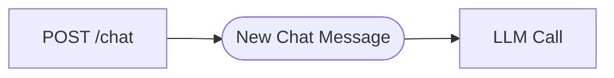
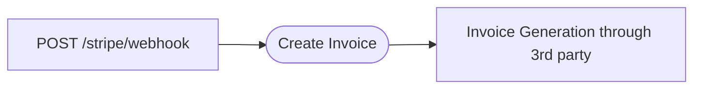

# Motia

A framework to develop serverless and distributed event-driven architecture backends
without the burden of maintaining complex infrastructure.

## Key benefits of using Motia

- 🔗 Create API endpoints that run independent of each other. Processes and memory of one endpoint does not affect other API endpoints.
- 🧵 Create Tasks that should run whenever an Event is triggered on the platform.
- ⏳ Create Scheduled Tasks to run at a given time period to automate your process.
- 📦 Share same state across all different tasks that can run in serial or concurrently.
- 🔣 Support multi-language execution files in the same project. Motia supports Python and Node.JS all sharing the same state.
- 🤝 With Motia Workbench, you can share your workflows with non-technical stakeholders, having a single source of truth of the business logic that's actually implemented.
- 🚀 Quickly deploy to a live environment with a single command.

## Workbench

Motia has an out of the box tool to easily visualize the workflows within a project,
making a new paradigm of collaboration between engineers and non-technical stakeholders
like Product Manager or even Engineering Manager who are technical but not deeply involved in the codebase.

## Creating REST Endpoints (Aka API Steps)

As any other framework, Motia allows creating API Endpoints. But what's different is that they
ultimately run on isolated and serverless environments. Which means that there will be no bottleneck
endpoints on your back-end, they run on completely separated servers, aka nano-services.

These endpoints may trigger events to be processed asynchronously, like an AI agent that orchestrate
multiple other AI agents, has MCP and tool calls, all the stuff that are highly susceptible to fault.

## Creating Event handlers (Aka Event Steps)

As mentioned up above, automations that are highly susceptible to fault, like LLM calls and
non-deterministic flows should run as an Event processing. A REST Endpoint triggers an event,
that asynchronously invoke remote code. Like the example below.

That's not limited to just LLM calls, _Event Steps_ can be used to process important stuff
that need to be processed regardless of third-party tools failures.

**Example:** Receiving a Webhook of a payment from Stripe and creating an invoice.

If the creation of the invoice fails, the payment would still be processed, that means we
need to ensure the invoice is always generated.

## Creating scheduled tasks (Aka Cron Steps)

Any background task that need to run on a scheduled basis is relevant here, like clearing unused
data from the database, sending marketing e-mails, etc.

## Everything is a Step

The core component of Motia is Step, any executable function is a step. With Motia you can chain
multiple steps together and create really complex flows. A step can be created in either NodeJS or
Python, all sharing the same state.

## Using Motia

Please refer to the [Motia Documentation](https://www.motia.dev/docs) for more information.
