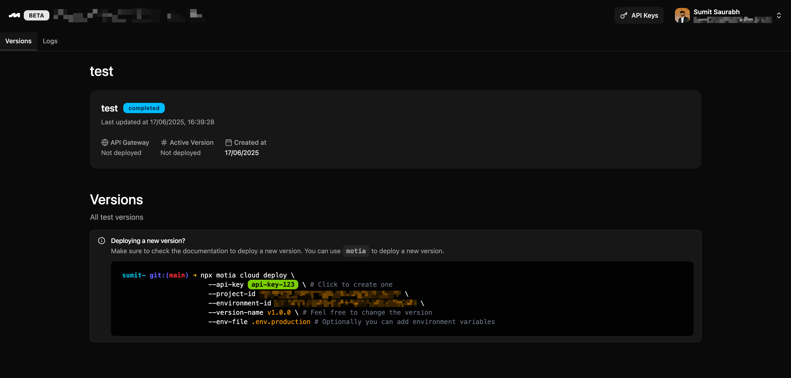

Deploy your Motia workflows to various environments with a robust, reliable deployment system designed for enterprise-grade applications. Whether you're deploying simple APIs or complex AI-powered flows, Motia's CLI and deployment architecture make the process reliable and observable.

## How to deploy
To deploy a Motia app:
1. Simply sign in at [Motia Cloud](https://www.motia.cloud/). 
2. Once signed in, you'll be in the Motia Cloud Dashboard. From here, you can:
      - Create a new project
      - Switch between organizations, and
      - Change account settings
      
      We'll choose to create a new project.
  
3. Simply, click on the 'new project' button and enter your project information:
  
4. Once your project has been created, click on its name to open the project page and create a new environment:
  
5. Once your environment has been created, click on the environment name to open the environments page and you'll see the command to deploy to that environment. You can click the copy the deploy command.
  
<Callout type="info" title="Environment types">
Motia Cloud allows you to have many environment types for a project. You can test a new workflow in a `test` environment for example and push it to production once you've tested it.
</Callout>
6. Now, simply go to your code editor and run this command with your `api key` to deploy your project.
7. If you don't have an API key, you can create the same from your Motia Cloud dashboard:
  
<Callout type="warn" title="Motia Cloud API Key">
Once you create your API key on Motia Cloud, make sure to store it safely. For security reasons, API keys are only revealed once, when you actually create them!
</Callout>
Now, let's take a look the the `deploy` command in detail!
## CLI Reference

```bash
motia cloud deploy [options]
```

### Command Options

| Option | Alias | Description | Default |
|--------|-------|-------------|---------|
| `--environment` | `-e` | Target environment for deployment | `development` |
| `--version-name` | `-v` | Version tag for the deployment | Current timestamp |
| `--api-key` | `-k` | API key for authentication | None (required) |

As an example, following are the CLI commands you can use to deploy a Motia app to `Production` and `Staging` environments respectively:

<Tabs items={['Production', 'Staging']}>
<Tab value="Production">
Deploy to production with semantic versioning:

```bash
motia cloud deploy --environment production --version-name 1.2.3 --api-key your-api-key-here
```

Use semantic versioning for production deployments to maintain clear release history.
</Tab>

<Tab value="Staging">
Deploy to staging for pre-production testing:

```bash
motia cloud deploy --environment staging --version-name 1.2.3-rc.1 --api-key your-api-key-here
```

Staging deployments help validate changes before production release.
</Tab>
</Tabs>

## Deployment Architecture

Motia's deployment system uses a carefully designed three-phase approach that ensures reliability and provides excellent error recovery:
<Steps>
<Step>
### Upload Files
Each workflow step is packaged as a zip file and uploaded individually with complete path information preserved.
</Step>
<Step>
### Upload Configuration
The `motia.steps.json` configuration file is uploaded separately, containing your workflow definitions and metadata.
</Step>
<Step>
### Start Deployment
A deployment request is initiated with all uploaded files and configuration, triggering the server-side deployment process.
</Step>
</Steps>

## Architecture Benefits
This multi-phase approach provides several key advantages:

- **Granular Tracking**: Monitor the upload progress of individual files
- **Clean Separation**: Configuration and files are handled independently
- **Efficient Processing**: Optimized server-side handling of deployment artifacts
- **Validation:** Ensures all components are successfully uploaded before deployment begins 


## Deployment Process

When you execute `motia deploy`, the CLI orchestrates a comprehensive deployment workflow:

<Steps>
<Step>
Preparation
- Validates project structure and configuration files
</Step>

<Step>
File Collection
- Discovers all workflow step files in your project
- Packages each step into optimized zip archives
- Preserves directory structure and metadata
</Step>

<Step>
File Upload
- Uploads each zip file individually to the Motia platform
</Step>

<Step>
Configuration Upload
- Transmits your workflow configuration (`motia.steps.json`)
- Links configuration to uploaded step files
</Step>

<Step>
Deployment Initiation
- Triggers server-side deployment processing
- Monitors deployment progress and status
- Handles any deployment conflicts or issues
</Step>

<Step>
Status Reporting
- Provides detailed deployment results
- Generates comprehensive deployment reports
- Updates local deployment history files
</Step>
</Steps>


## Troubleshooting
1. **Check Deployment Reports**: Review `motia.deployments.json` for specific error messages and failed components
2. **Incremental Deployment**: Try deploying individual workflows or smaller batches to isolate issues
<Callout type="error" title="Authentication Failed">
**Problem**: Invalid or expired API key

**Solution**: 
- Verify your API key is correct and hasn't expired
- Contact your administrator if you need new credentials
</Callout>

<Callout type="warn" title="File Upload Errors">
**Problem**: Individual file uploads failing

**Solution**:
- Check your internet connection stability
- Verify file permissions in your project directory
- Ensure no files are locked by other processes
- Try the deployment again
</Callout>

## Next Steps
<Callout type='info' title='Deployment best practices'>
Make sure you're following all the [deployment best practices.](/docs/happy-practices#best-practices-of-deploying-a-motia-app)
</Callout>
<Cards>
  <Card
    title="🛠️ Motia CLI"
    description="Learn how to use the Motia CLI to deploy, inspect, and manage your workflows."
    href="/docs/cli"
  />
  <Card
    title="😊 Happy Practices"
    description="Explore tips and best practices to keep your Motia flows robust, maintainable, and joyful."
    href="/docs/happy-practices"
  />
</Cards>