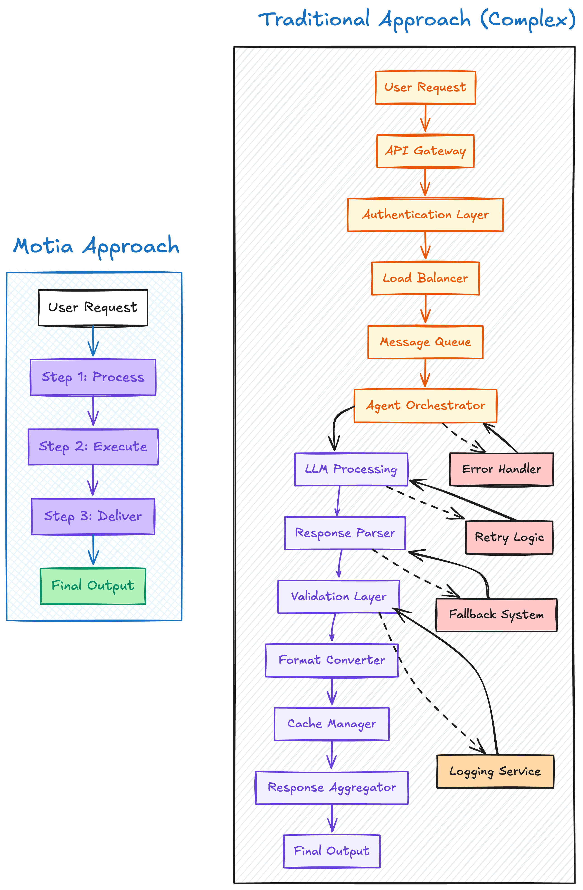

A Step is a language and runtime agnostic, modular, self-contained unit of backend logic. It’s the core abstraction in Motia—similar to what Components are in React. Just as Components manage UI, Steps manage backend logic and workflows.

> In a Motia app, everything is a Step.

## Why Steps?

Modern backends are becoming increasingly fragmented. Developers juggle between:

- Background jobs
- Queues and schedulers
- AI agents
- REST or GraphQL APIs

This leads to brittle systems stitched together with manual glue code.



Motia introduces Steps as a unifying concept: every backend action, whether it's calling an API, reacting to an event, or invoking an AI, becomes a Step.

## Anatomy of a Step
Each Step has two parts:

1. Configuration: Describes how the step behaves (`exports.config`)
2. Handler: Contains the logic that gets executed (`exports.handler`)

> Steps can be written in multiple languages (JS, TS, Python and more), even within the same workflow!
```ts
// exports.config defines the Step configuration
exports.config = {
  type: 'api',            // Type of step. This one is an API step. They expose an HTTP endpoint
  path: '/hello',         // The HTTP route that triggers this step
  method: 'GET',          // HTTP method to accept (GET, POST, etc.)
  name: 'HelloStep',      // Name of this step
  emits: [],              // List of events this step emits (this is used to chain steps together)
  flows: ['default'],     // Tag this step as part of the 'default' flow
}

// exports.handler contains the logic that gets executed when the step runs
exports.handler = async ({ query }) => {
  // Read query parameter from the incoming request
  const name = query.name

  // Return a JSON response with a greeting
  return {
    status: 200,
    body: { message: `Hello ${name}` },
  }
}
```

### Step Handler
When writing steps, you should pay special attention to Step Handlers. Though they appear just like simple functions, handlers are the heart of your logic. 

_They’re where all the actual work happens._

When an event occurs that matches the step's [subscribed topics](#the-two-behaviours-of-a-step), the handler automatically runs with two key pieces of information:
1. The input data from the triggering event
2. A context object that provides powerful tools for workflow orchestration

The `input` contains the data from the triggering event, while the context object provides essential workflow tools.

#### Input data
The input data is the first parameter passed to every handler, containing the payload from the triggering event or API request. How you extract input data depends on the [type of the step](/docs/foundations/types-of-step) you're using:
| Step Type       | Input Source Description                                                  |
|------------------|---------------------------------------------------------------------------|
| **API Steps**     | Uses data from: <br/>– `body`: JSON from POST/PUT requests, or <br/>– `query`: URL query parameters, or <br/>– `URL params`: Dynamic URL segments (e.g. `id` from the URL`/user/:id`), or <br/>– `headers`: HTTP request headers |
| **Event Steps**   | Input comes from the `data` field of the emitted event                  |
| **Scheduled Steps** | Input is defined statically or dynamically by the schedule configuration |

#### Context Object
The context object is the second parameter containing all the utilities needed for workflow execution. It's your interface to Motia's runtime environment and has the following core properties:
- `emit`: The event engine of Motia lets steps communicate with each other using [`emit` and `subscribe`](/docs/foundations/steps#the-two-behaviours-of-a-step). Use it to send processed data to other steps via topics or simply handoff processing to some other step. Events can be emitted to single or multiple subscriber steps.
- `traceId`: A unique identifier (UUID) for the current workflow execution. Essential for data isolation, debugging, and tracking operations across multiple steps. Each workflow run gets its own `traceID` that remains constant throughout the entire execution.
- `state`: The persistence layer for sharing data between steps. [State manager](/docs/foundations/state-mgt) provides scoped storage with get, set, delete, and clear operations. Supports different storage backends including memory, file, and Redis adapters.
- `logger`: Motia provides a built-in [structured logging system with multiple log levels](/docs/foundations/logging#writing-logs-using-the-logger-object) (info, error, debug, warn). It automatically includes contextual metadata like timestamps, trace IDs, and source file information.
- `streams`: [Streams provides real-time data streaming system](/docs/foundations/streams) for pushing live updates to frontend applications. It enables progressive UI updates for long-running operations like file uploads, AI communication, or data processing.

Here's an example of how to define a handler in a few languages:

<Tabs items={['TS', 'JS', 'Python']}>
  <Tab value="TS">
    ```typescript
    import { EventConfig, Handlers } from 'motia'

    export const config: EventConfig = {
      type: 'event',
      name: 'MinimalStep',
      subscribes: ['start'],
      emits: ['done'],
    }

    export const handler: Handlers['MinimalStep'] = async (input, { emit, traceId, state, logger }) => {
      await emit({ topic: 'done', data: {} })
    }
    ```
  </Tab>
  <Tab value="JS">
    ```javascript
    exports.config = {
      type: 'event',
      name: 'Minimal Step',
      subscribes: ['start'],
      emits: ['done'],
    }

    exports.handler = async (input, { emit, traceId, state, logger }) => {
      await emit({ topic: 'done', data: {} })
    }
    ```
  </Tab>
  <Tab value="Python">
    ```python
    config = {
        'type': 'event',
        'name': 'Minimal Step',
        'subscribes': ['start'],
        'emits': ['done'],
    }

    async def handler(args, ctx):
      await ctx.emit({'topic': 'done', 'data': {}})
    ```
  </Tab>
</Tabs>

## Common step configuration

A step's configuration is defined through a `config` object that must be exported. This object contains essential properties that tell Motia how to interact with the step. Here's the common configuration of steps:

<DescriptionTable
  type={{
    type: {
      description: 'The step type: event, api, or cron',
      type: 'string',
    },
    name: {
      description: 'A unique identifier for the step, used in Motia Workbench visualization tool',
      type: 'string',
    },
    subscribes: {
      description: 'A list of topics this step listens to',
      type: 'string[]',
      default: []
    },
    emits: {
      description: 'A list of topics this step can emit',
      type: 'string[]',
    },
    flows: {
      description: 'A list of flow identifiers that this step belongs to',
      type: 'string[]',
    },
    description: {
      description: 'Optional description for documentation and visualization',
      type: 'string',
    }
  }}
/>
<Callout title="Steps" type="warning">
  Note that in addition to common configuration, some steps have additional properties. Take a look at the respective <a href="/docs/foundation/types-of-step">type of step</a> to know the exact configuration of that step type.
</Callout>

## The two behaviours of a Step
Each step has two behaviors - Subscription, and Emission:
1. Subscribe: This behavior dictates the events to which a step listens to.  
Example: `subscribes: ['user.registered', 'payment.success']`
2. Emit: This behavior dictates to which step is the current one passing the baton to. A step can emit to zero/one/many step(s).  
Example: `emits: ['send-welcome-email', 'trigger-invoice']`

You can see the subscription and emission of each step from the Workbench as well.

> The Workbench also shows you which language the step was written in. Each step can be written a different language, even within the same workflow.


## Next steps
Steps are the single-most important part of a Motia apps. Therefore, it makes tremendous sense to learn about them well. Here's where you can go to for the same:
<Cards>
  <Card
    href="/docs/foundations/types-of-step"
    title="Types of Steps"
    icon="📦"
  >
  Adopt a new mental model for AI-native, modern backends - one Step at a time.
  </Card>

  <Card
  href="/docs/foundations/steps-advanced"
  title="Powering Up Your Steps"
  icon="🛠️"
>
Explore advanced capabilities of Steps: custom visuals, no-operation (NOOP) and more!
</Card>
</Cards>
---