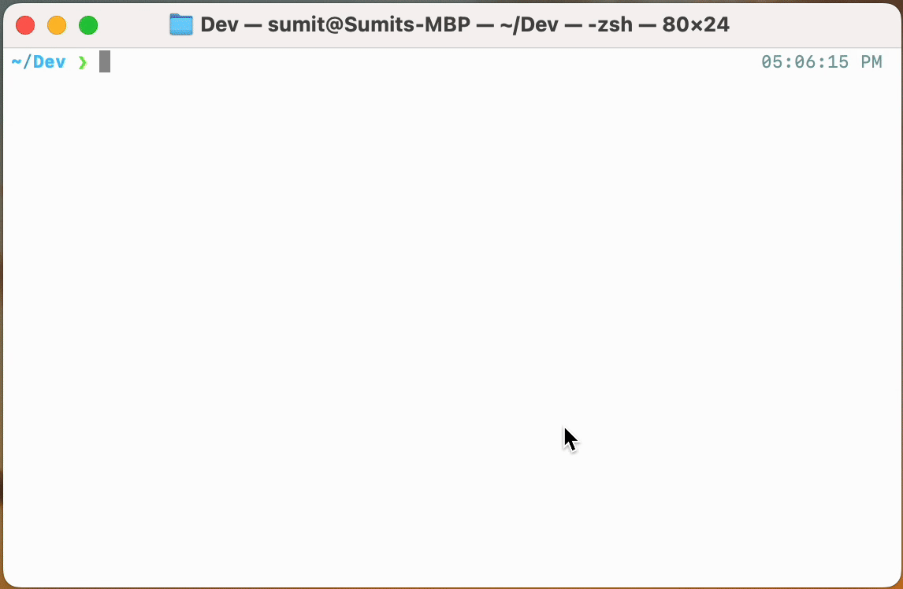
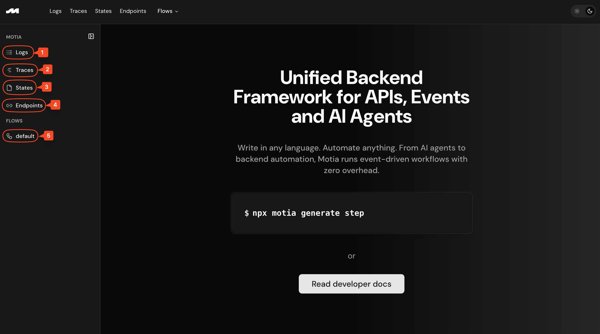

This quickstart will give you 90% of what you'll use on a daily basis. Let's spin up a Motia app and see everything in action, _in less than 60 seconds!_  

You'll learn:
- How to initialize a new Motia app
- How to write steps
- How to use Motia Workbench
- Where to learn more
<Steps>
<Step>
## Initialize a new project
Execute the following command and Motia will scaffold a new project and install all the dependencies:
```bash
npx motia@latest create -i
```
  
 This command will:
 - Ask you if you want to use a pre-built template,
 - Ask you if you want to create a Motia project in the current directory or do you have a name for your project,
 - scaffold a new Motia project,
 - install all the dependencies, and
 - create files for different steps.

</Step>
<Step>
## Navigating steps and the workbench

  Now, `cd` into the directory, open up your favourite code editor there, and you'll files for a few steps already created for you.
  
<Callout title="Steps" type="info">
  Steps are the fundamental, building blocks of a Motia app. They are reusable units of code, each of which can recieve an input data, perform logic and output data or trigger another event. Read more about them in our [introductory blog](https://dev.to/motiadev/introducing-motia-3oja-temp-slug-3967652?preview=c67eba085f74a7cf7b2c509a1548676bce436734e51ef49f52b1927b110de0fa2e214aa713e90c7a3301332e5d0eb658a6d1bdacb9a4777d93f37b52).
</Callout>
> Everything is a Step. Steps are like React Components - reusable, isolated units of logic that handle specific tasks. Combine individual steps and you get a workflow. Learn what [Steps are](/docs/steps) and [their types](/docs/types-of-step).

Let's fire up the workbench and see what Motia gives you by default
</Step>
<Step>
## Using Motia Workbench
  Now, fire up the Motia workbench to visualize the data flow, test API endpoints and debug locally. To start it, simply run `npm run dev` and it will launch at [`http://localhost:3000`](http://localhost:3000).
  
  From the Workbench, you can navigate to:
  1. Logs: To get structured logs for each step execution, including inputs, outputs, and errors.
  2. Traces: To track operations across multiple steps in a workflow.
  3. States: To view the internal state and data passed between steps using `traceID` and `field`.
  4. Endpoints: To see and test all your API endpoints from within the Workbench:
  5. Flows: To visually inspect how your steps are connected and triggered, what each step does, which language it was written in, what events does it subscribe/emit to and more:
  
  > You can click on any step to know more about it - the language it was written in, what events does it emit/subscribe to and more!
</Step>
<Step>
## You're up and running! 🎉
That's it! This is how simple it is to have a fully functional Motia app - with an API step, automatic routing, a visual debugger, and zero setup hassle.

From here, you can:

- Add new steps (.step.ts) to handle events, schedule jobs, or trigger AI agents
- Wire up complex workflows using just event emissions
- Debug and iterate in real-time with the Workbench
- Add AI agentic logic to one/many step(s), and 
- Build out full-blown backend systems with modular logic
</Step>
<Step>
## Learn more

Now that you have Motia running locally, you're ready to build anything you want. Here are some recommended next steps:

**Learn the fundamentals:**
- [Understanding Steps](/docs/steps) - Master the core building blocks
- [Emit and Subscribe](/docs/steps#the-two-behaviours-of-a-step) - Learn how steps communicate
- [State Management](/docs/state-mgt) - Learn how to persist data in Motia apps

**Learn from real-world examples:**
- [AI-Powered Gmail Automation](https://github.com/MotiaDev/motia-examples/tree/main/examples/gmail-workflow) - Automate Gmail with AI
- [PDF RAG Q&A System](https://github.com/MotiaDev/motia-examples/tree/main/examples/rag-docling-weaviate-agent) - Build a document question-answering system
- [Browse Examples](https://github.com/MotiaDev/motia-examples) - Explore community maintained list of Motia workflows.

**Get help and connect:**
- [Join our Discord](https://discord.gg/EnfDRFYW) - Connect with other builders
- [GitHub Repository](https://github.com/MotiaDev/motia) - Contribute and report issues
- [API Reference](/docs/api-ref) - Dive deep into Motia's capabilities

The beauty of Motia is that whether you're building a simple API, a complex AI agent, or an enterprise workflow, it all starts with the same simple concept: **Steps**. 

Happy building! 🚀

</Step>
</Steps>


## Next Steps?
When writing a Motia app, 90% of your time will be spent on writing, modifying and managing Steps. 

Steps are the building blocks of your Motia app and they're what you'll spend most of your time on. So, learning more about Steps makes tremendous sense.

Here's where you can go to next, if you wanna dive deeper:
<Cards>
  <Card
  href="/docs/steps"
  title="What are Steps"
  icon="🧱"
>
  Get to know the core building block of Motia - how Steps receive, process, and emit data.
</Card>
 
    <Card
    href="/docs/types-of-step"
    title="Types of Steps"
    icon="📦"
  >
  Follow guides to automate tasks with AI and APIs - like sending emails with GPT.
  </Card>
</Cards>
---