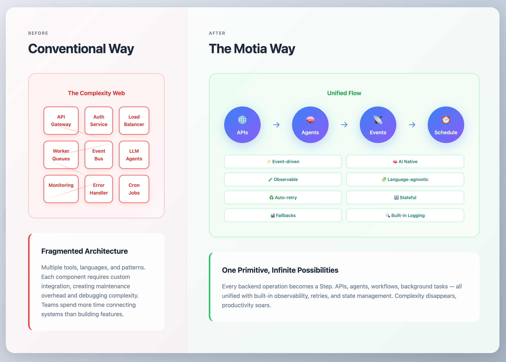

# What is Motia?

Motia is the first unified backend framework built for the AI-native era. It has been designed to seamlessly handle APIs, events, and AI agents in a single cohesive system, using one primitive: _The Step_.

- Every step can be written in a different language (even within the same workflow) and is defined by a configuration object and its corresponding handler function.
- Steps can be of three types: API, Event, and CRON, depending on how you want to trigger a step.
- Steps can emit and subscribe to other steps, enabling you to chain them together to create powerful, even-based workflows.

That's it. With these three concepts, you can model anything, from simple API endpoints to complex AI agent orchestrations.

> Everything in a Motia app is a Step. Steps enable to you build anything: from API to AI!

The whole idea of Motia is to break down backend systems into small, focused steps. Each step handling a single unit of logic, whether it’s responding to an API call, reacting to an event, or running on a schedule. 

These steps are then chained together declaratively, using emits and subscribes, to form powerful, traceable workflows.

Instead of managing scattered APIs, background jobs, queues, and AI logic in separate silos, Motia lets you model your entire system as a network of steps: modular, observable, language-agnostic, and easy to test. 

You write just the logic, and let Motia handle orchestration, deployments, reliability, and observability under the hood.

<Cards>
  <Card
    href="https://dev.to/motiadev/introducing-motia-3oja-temp-slug-3967652?preview=c67eba085f74a7cf7b2c509a1548676bce436734e51ef49f52b1927b110de0fa2e214aa713e90c7a3301332e5d0eb658a6d1bdacb9a4777d93f37b52"
    title="Why we exist"
  >
    Read our introductory blog and discover why we built Motia
  </Card>
  <Card
    href="https://www.motia.dev/manifesto"
    title="Our manifesto"
  >
    Go through Motia's manifesto that outlines our vision.
  </Card>
</Cards>

## Built for Scale, Built for Engineers

Motia isn’t just another tool. It’s a natural evolution in response to the real-world challenges of building and scaling modern backend systems. As workflows grow and codebases evolve, hidden complexity begins to surface, especially when APIs, events, background jobs, and AI agents are all handled in separate silos. 

Motia unifies these into a single system with the simplicity of “steps”, and comes with the following features right out of the box:

- **Code-First Development**: Write agent logic in familiar languages without proprietary syntax or visual constraints.
- **Multi-language Support**: Write steps in TypeScript, Javascript, Python, and more (additional languages coming soon).
- **Interactive Workbench**: Local development with Motia Workbench for workflow visualization and debugging.
- **Event-Driven Architecture**: Built-in observability with real-time logs, traces, and interactive flow visualizations, enabling reactive systems that respond to webhooks, scheduled tasks, and internal events.
- **Built-in State Management**: Unified state across APIs, background jobs, and events with shared context and data persistence.
- **Streams**: Push updates from asynchronous workflows to the client without polling.
- **Production-Ready Deployment**: Coming soon with Motia Cloud! Zero Config Deployment, Real-Time Monitoring, Instant Rollback.
- **Hot Reload Development**: Changes reflect instantly, for rapid iteration and testing. Change it. See it. Run it. Deploy it.
- **Enterprise Ready**: Designed with enterprise-scale resilience in mind, from Day one.

With all these features, Motia is a system that grows with your ambitions: from rapid prototyping to production-scale deployment, without sacrificing the developer experience or forcing architectural compromises. 

Motia transforms the complexity of modern backend development into the simplicity of composable steps, letting you focus on what truly matters: _building exceptional products that solve real problems_.

> A system like Motia is needed and will happen. Whether Motia becomes the standard or leads the way, a developer-first framework that unifies AI-driven backend complexity is the natural evolution of software engineering.
> 
>Motia is that system.

## Learn by Building

Master Motia through hands-on tutorials and real-world examples:

### Real-World Guides

<Cards>
  <Card
    href="https://github.com/MotiaDev/motia-examples/tree/main/examples/gmail-workflow"
    title="Intelligent Gmail account manager"
    icon="✉️"
  >
    Build a smart email system with auto-labeling, filtering, and LLM-powered replies.
  </Card>

  <Card
    href="https://github.com/MotiaDev/motia-examples/tree/main/examples/rag-docling-weaviate-agent"
    title="PDF RAG Q&A System"
    icon="📄"
  >
    Use Docling, and OpenAI to build a RAG system to answer questions from PDF documents.
  </Card>
</Cards>

## Ready to Transform Your Backend?
The future of backend development is unified, intelligent, and developer-first. 

While the industry continues to struggle with countless tools and frameworks, Motia offers a different path, one where complexity becomes clarity, where scattered systems become cohesive workflows, and where your focus shifts from infrastructure management to innovation.

Whether you're building your first AI agent, scaling a complex enterprise system, or simply tired of juggling multiple backend frameworks, Motia meets you where you are and grows with where you're going.