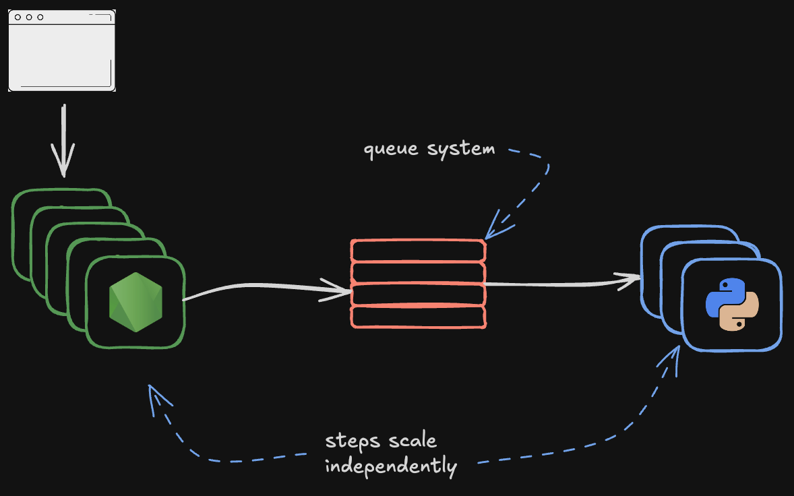

## Why use Motia

Motia was created to simplify common backend engineering challenges. Today, backend engineers and software architects face several recurring problems, including

1. Fault tolerance
2. Scalability
3. Observability
4. Multiple languages
5. Building and shipping
6. Rollbacks and deployments strategies

## Fault tolerance

With the rise of AI, many backend tasks have become less deterministic and more error-prone. These scenarios require robust error handling and retry mechanisms. In traditional systems, developers often need to set up and maintain queue infrastructures to ensure resilience, especially when dealing with unreliable responses from LLMs.

Motia provides fault tolerance out of the box, eliminating the need to manually configure queues and retries.

## Scalability

One of the biggest dilemmas in backend development is choosing between scalability and development velocity. In startup environments, speed often takes priority, resulting in systems that don't scale well and become problematic under increased load.

Motia addresses scalability by introducing a simple core primitive: **Steps**. Each step represents a distinct entry point—triggered by an API call, an event, or a CRON job. Whereas each step can scale independently avoiding the bottlenecks common in monolithic architectures.

## Observability

Observability in traditional backends often demands significant engineering effort to implement logging, alerting, and tracing. Typically, these tools are only configured for cloud environments, local development is generally neglected—leading to low productivity and poor dev experience.

Motia offers a complete observability toolkit available in both cloud and local environments, ensuring consistent monitoring across all stages of development.

## Working with multiple Languages

The rapid advancement of AI has reshaped the software industry—many cutting-edge AI tools are available only in specific programming languages, this forces companies to decide if they either change their team's skillset to a different language or not leveraging these technologies at all.

Motia removes this limitation by allowing each step to be written in any language, while still sharing a common state.

## Building and Shipping

Building and deploying backends is inherently complex—especially in polyglot environments. Shipping production systems requires tight collaboration between developers and operations, and automation often takes weeks to get right.

Beyond that, cloud provider lock-in, complicated deployment strategies (e.g., rollbacks, blue/green deployments), and a lack of deployment tooling increase the risk of failure.

Motia abstracts these concerns by providing:

1. True cloud-provider agnosticism
2. Atomic blue/green deployments and one-click rollbacks via Motia Cloud (canary support coming soon)
3. First-class polyglot backend support (currently Node.js and Python, with more on the way)

## Atomic deployments

Deploying cloud-native, fault-tolerant applications often involves modifying queue systems and other infrastructure components. These changes can introduce incompatibilities and lead to runtime failures

Motia Cloud solves this with **Atomic Deployments**. Each deployment spins up a new isolated service that shares the same data layer. This architecture ensures safe, rollback-capable deployments without risking service downtime.