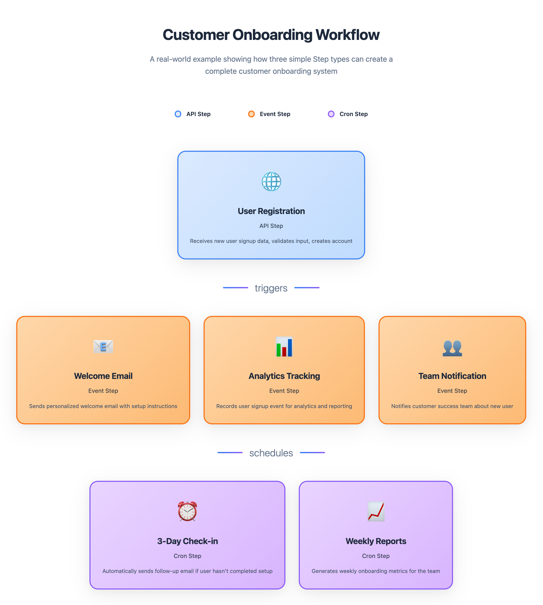

In Motia, a Step is the smallest unit of backend logic. Every Step must belong to one of three types: `api`, `event`, or `cron`. Each type defines how and when a Step is triggered and how it fits into your overall flow.

> Steps are language and runtime agnostic. Meaning, you can have one steps written in Python, another written in TypeScript or some other language and they could all be part of the same workflow.

Let’s break down what each type does, when to use it, and what makes it powerful.
## Types of Steps
Every step follows the <a href="/docs/steps#common-step-configuration">common step configuration,</a> but can have some properties of their own. Let's take a look at the different types of steps and their configuration:
### 1. Event Step
Event Steps, as the name suggests, are designed to respond when something happens. They let you define, “When this _event_ occurs, do that.” Think of them as the building blocks that power reactive, event-driven behavior in your workflows. 

When an event occurs, you want to either execute some logic and/or trigger another step, and you can do it all with event steps.

By using the subscription <a href="/docs/steps#the-two-behaviours-of-a-step">behavior</a> of event steps, you define which event shall it listen to. And by using the emission <a href="/docs/steps#the-two-behaviours-of-a-step">behavior</a>, you define which events does it then trigger. Using these two behaviors, you can build powerful chains of logic through event routing.

You can handle the execution of logic using the handler associated with each step, including the event step.

You can use Event Steps to:
- React to system-generated events or outputs from other steps
- Decouple your logic into clean, isolated reactions
- Kick off workflows based on internal or external signals

In addition to the <a href="/docs/steps#common-step-configuration">common step configuration</a>, event steps have one more property - `input`, making the configuration for Event steps as follows:

<DescriptionTable
  type={{
    type: {
      description: 'The step type: event, api, or cron',
      type: 'string',
    },
    name: {
      description: 'A unique identifier for the step, used in Motia Workbench visualization tool',
      type: 'string',
    },
    subscribes: {
      description: 'A list of topics this step listens to',
      type: 'string[]',
      default: []
    },
    emits: {
      description: 'A list of topics this step can emit',
      type: 'string[]',
    },
    flows: {
      description: 'A list of flow identifiers that this step belongs to',
      type: 'string[]',
    },
    description: {
      description: 'Optional description for documentation and visualization',
      type: 'string',
    },
    input: {
      description: 'This is used for input validation. For TypeScript/JavaScript steps, it uses zod schemas. For Python steps, it uses Pydantic models.',
      type: 'string[]',
    }
  }}
/>

And here's how you define a step:

<Tabs items={['TS', 'JS', 'Python']}>
<Tab value="TS">

```ts
import { EventConfig, Handlers } from 'motia'
import { z } from 'zod'

export const config: EventConfig = {
  type: 'event',
  name: 'greetUser',
  description: 'Greets the user with a custom message',
  subscribes: ['start'],
  emits: ['greeted'],
  input: z.object({ name: z.string() }),
  flows: ['greet-flow'],
}

export const handler: Handlers['greetUser'] = async (input, { emit, logger }) => {
  logger.info(`Greeting user: ${input.name}`)

  await emit({
    topic: 'greeted',
    data: {
      message: `Hello, ${input.name}!`
    }
  })
}
```
</Tab>
<Tab value="JS">
```js
const z = require('zod');

const config = {
  type: 'event',
  name: 'greetUser',
  description: 'Greets the user with a custom message',
  subscribes: ['start'],
  emits: ['greeted'],
  input: z.object({ name: z.string() }),
  flows: ['greet-flow'],
};

const handler = async (input, { emit, logger }) => {
  logger.info(`Greeting user: ${input.name}`);

  await emit({
    topic: 'greeted',
    data: {
      message: `Hello, ${input.name}!`
    }
  });
};

module.exports = { config, handler };
```
</Tab>
<Tab value="Python">
```python
config = {
  "type": "event",
  "name": "greetUser",
  "description": "Greets the user with a custom message",
  "subscribes": ["start"],
  "emits": ["greeted"],
  "input": {
    "type": "object",
    "properties": {
      "name": { "type": "string" }
    },
    "required": ["name"]
  },
  "flows": ["greet-flow"]
}

async def handler(input, ctx):
  name = input.get("name", "Guest")
  ctx.logger.info(f"Greeting user: {name}")

  await ctx.emit({
    "topic": "greeted",
    "data": {
      "message": f"Hello, {name}!"
    }
  })
```
</Tab>
</Tabs>

### 2. API Step
API steps are the default entry point into your chain of steps in a workflow. They are triggered when an external client makes an HTTP request to a defined endpoint. You can use API steps to expose functionality to the outside world or to kick off automated workflows from a frontend or third-party systems.

API steps use the default <a href="/docs/steps#the-two-behaviours-of-a-step">behavior</a> of any Motia step: _Subscription_ and _Emission,_ to chain together a series of backend actions. 

This allows you to expose an HTTP endpoint, process the incoming request, and seamlessly trigger follow-up steps in your workflow.

They're ideal for:
- Creating REST endpoints
- Triggering workflows from frontend apps
- Accepting webhooks from third-party services

API steps follow the <a href="/docs/steps#common-step-configuration">common step configuration</a> of a step in Motia and have a few additional properties of their own, thereby making their configuration as follows:

<DescriptionTable
  type={{
    type: {
      description: 'The step type: event, api, or cron',
      type: 'string',
    },
    name: {
      description: 'A unique identifier for the step, used in Motia Workbench visualization tool',
      type: 'string',
    },
    subscribes: {
      description: 'A list of topics this step listens to',
      type: 'string[]',
      default: []
    },
    emits: {
      description: 'A list of topics this step can emit',
      type: 'string[]',
    },
    flows: {
      description: 'A list of flow identifiers that this step belongs to',
      type: 'string[]',
    },
    description: {
      description: 'Optional description for documentation and visualization',
      type: 'string',
    },
    path: {
      description: 'The HTTP path for the API endpoint',
      type: 'string',
    },
    method: {
      description: 'The HTTP method for the API endpoint (GET, POST, PUT, DELETE, etc.)',
      type: 'string',
    },
    bodySchema: {
      description:
        'Schema for validating the request body. For TypeScript/JavaScript steps, it uses zod schemas. For Python steps, it uses Pydantic models.',
      type: 'object',
    },
    responseSchema: {
      description:
        'Mostly used for documentation, the expected output of an API endpoint. For TypeScript/JavaScript steps, it uses zod schemas. For Python steps, it uses Pydantic models or Dict Json Schema.',
      type: 'object',
    },
    queryParams: {
      description: 'Mostly for documentation, the expected query params',
      type: 'array',
    },
    middleware: {
      description: 'Optional middleware functions to run before the handler',
      type: 'array',
    }
  }}
/>

And here's how you define an API step:

<Tabs items={['TS', 'JS', 'Python']}>

<Tab value="TS">

```ts
import { ApiRouteConfig, Handlers } from 'motia'
import { z } from 'zod'

export const config: ApiRouteConfig = {
  type: 'api',
  name: 'HelloStep',
  path: '/hello',
  method: 'GET',
  description: 'Returns a simple greeting message.',
  responseSchema: {
    200: z.object({
      message: z.string(),
    }),
  },
}

export const handler: Handlers['HelloStep'] = async (req, { logger }) => {
  logger.info('Hello endpoint was called')

  return {
    status: 200,
    body: { message: 'Hello from Motia!' },
  }
}
```
</Tab>
<Tab value="JS">
```js
const { z } = require('zod')

exports.config = {
  type: 'api',
  name: 'HelloStep',
  path: '/hello',
  method: 'GET',
  description: 'Returns a simple greeting message.',
  responseSchema: {
    200: z.object({
      message: z.string(),
    }),
  },
}

exports.handler = async (req, { logger }) => {
  logger.info('Hello endpoint was called')

  return {
    status: 200,
    body: { message: 'Hello from Motia!' },
  }
}
```
</Tab>
<Tab value="Python">
```python
config = {
    "type": "api",
    "name": "HelloStep",
    "path": "/hello",
    "method": "GET",
    "description": "Returns a simple greeting message.",
    "responseSchema": {
        200: {
            "message": {
                "type": "string",
                "description": "Greeting message",
            }
        }
    },
}

async def handler(req, ctx):
  ctx.logger.info("Hello endpoint was called")

return {
    "status": 200,
    "body": { "message": "Hello from Motia!" }
}
```
</Tab>
</Tabs>

<Callout title="Steps" type="info">
Note that API steps can use middlewares to intercept and process incoming requests before handing them off to their respective handlers. Checkout these advanced capabilities in _Powering up your steps_ to <a href="/docs/customising-steps/middlewares">use middlewares in API steps.</a> 
</Callout>

### 3. Cron Steps
Cron steps run on a schedule using cron expressions like `0 13 * * *` to run a step _every day at 1 PM._ They are perfect for automating daily reports, cleanup tasks, or scheduled jobs that need to run without manual input. Cron Steps are perfect for:
- Daily reports
- Scheduled cleanups
- Periodic reminders

In addition to the <a href="/docs/steps#common-step-configuration">common step configuration</a>, cron steps have one more property of their own - `cron`, making the configuration for Cron steps as follows:
<DescriptionTable
  type={{
    type: {
      description: 'The step type: event, api, or cron',
      type: 'string',
    },
    name: {
      description: 'A unique identifier for the step, used in Motia Workbench visualization tool',
      type: 'string',
    },
    subscribes: {
      description: 'A list of topics this step listens to',
      type: 'string[]',
      default: []
    },
    emits: {
      description: 'A list of topics this step can emit',
      type: 'string[]',
    },
    flows: {
      description: 'A list of flow identifiers that this step belongs to',
      type: 'string[]',
    },
    description: {
      description: 'Optional description for documentation and visualization',
      type: 'string',
    },
    cron: {
      description: 'The cron schedule expression for your step',
      type: 'string',
    }
  }}
/>
And here's how you define a cron step:

<Tabs  items={['TS', 'JS', 'Python']}>
  <Tab value="TS">
    ```typescript
    import { CronConfig, Handlers } from 'motia'

    export const config: CronConfig = {
      type: 'cron' as const,
      name: 'PeriodicJob',
      description: 'Runs every minute and emits a timestamp',
      cron: '0 * * * *', // run every hour at minute 0
      emits: ['cron-ticked'],
      flows: ['cron-example'],
    }

    export const handler: Handlers['PeriodicJob'] = async ({ emit }) => {
      await emit({
        topic: 'cron-ticked',
        data: { message: 'Cron job executed' },
      })
    }
    ```

  </Tab>
  <Tab value="JS">
    ```javascript
    const config = {
      type: 'cron',
      name: 'PeriodicJob',
      description: 'Runs every minute and emits a timestamp',
      cron: '0 * * * *', // run every hour at minute 0
      emits: ['cron-ticked'],
      flows: ['cron-example'],
    };

    const handler = async ({ emit }) => {
      await emit({
        topic: 'cron-ticked',
        data: { message: 'Cron job executed' },
      })
    }

    ```

  </Tab>
  <Tab value="Python">
    ```python
    config = {
        "type": "cron",
        "name": "PeriodicJob",
        "description": "Runs every minute and emits a timestamp",
        "cron": "0 * * * *",
        "emits": ["cron-ticked"],
        "flows": ["cron-example"]
    }
  
    async def handler(context):
        await context.emit({
            "topic": "cron-ticked",
            "data": { "message": "Cron job executed" },
        })

    ```
  </Tab>
</Tabs>    

## Summary
Each type of Step serves a distinct purpose, but together, they offer a powerful and unified model for orchestrating all kinds of backend logic. Here's a summary of the three types of Steps supported by Motia:
| Step Type | Trigger                  | Ideal Use Case                              |
|-----------|--------------------------|----------------------------------------------|
| API       | HTTP Request             | Frontend or external system triggers         |
| Event     | Emitted Topic            | Reactive flows based on internal events      |
| Cron      | Time-based (Cron Schedule) | Recurring tasks and automation             |




Instead of juggling multiple tools, patterns, and services, Motia gives you one abstraction _Steps_, that scales from API calls to background jobs to AI agents.

<Callout title="Steps" type="info">
  Note that in addition to the standard types of Steps, Motia also lets you power up the capabilities of your steps by customising steps, using middlewares and more. Don't forget to checkout the 'Motia Advanced' section in our docs for the same!
</Callout>