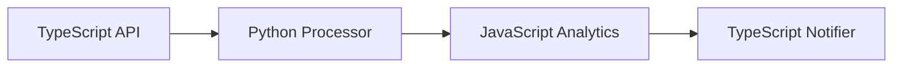

Motia simplifies backend development with a unified approach: **everything is a Step**. Whether you're building APIs, processing data, scheduling tasks, or creating workflows, Motia handles it all through composable, multi-language steps with automatic type safety and observability.

## The Motia Philosophy: Everything is a Step

Similar to how React simplified frontend development where everything is a component, **Motia simplifies backend development where everything is a Step**. In Motia, every backend pattern becomes a group of composable steps with unified state, events, and observability.

<Callout type="info">
**🌍 Multi-Language from Day One** 

Write each step in the best language for the job - **TypeScript**, **Python**, **JavaScript**, or more to come. Motia automatically handles type safety, data validation, and seamless communication between languages.
</Callout>

## Core Step Types

Motia provides four fundamental step types that cover all backend patterns:

### 🌐 **API Steps** - HTTP Endpoints
Expose REST endpoints that trigger workflows. Perfect for external integrations and user-facing APIs.

```typescript title="user-api.step.ts"
export const config = {
  type: 'api',
  path: '/users/:id',
  method: 'GET',
  emits: ['user.fetched']
}
```

### ⚡ **Event Steps** - Async Processing  
React to events from other steps. Handle business logic, data processing, and workflow orchestration.

```python title="process-user.step.py"
config = {
    'type': 'event',
    'subscribes': ['user.fetched'],
    'emits': ['user.processed']
}
```

### ⏰ **Cron Steps** - Scheduled Tasks
Run tasks on schedules using cron expressions. Ideal for cleanup, reports, and maintenance.

```javascript title="daily-report.step.js"
export const config = {
  type: 'cron',
  schedule: '0 9 * * *', // Daily at 9 AM
  emits: ['report.generated']
}
```

### 🔗 **NOOP Steps** - Visual Placeholders
Represent manual processes or external systems in your workflow diagrams for complete visibility.

**➡️ [Learn More about Defining Steps](/docs/concepts/steps/defining-steps)**

## Flows: Orchestrating Multi-Language Workflows

**Flows** organize your steps into logical workflows. Steps connect through topics - when one step emits an event, other steps can subscribe and react. This creates powerful data pipelines that span multiple languages.



### Real-World Flow Example

```typescript title="01-api.step.ts"
// TypeScript API receives data
export const config = {
  type: 'api',
  path: '/process-data',
  emits: ['data.received'],
  flows: ['data-pipeline']
}
```

```python title="02-processor.step.py"
# Python processes with ML libraries
config = {
    'type': 'event',
    'subscribes': ['data.received'],
    'emits': ['data.processed'],
    'flows': ['data-pipeline']
}
```

```javascript title="03-analytics.step.js"
// JavaScript generates insights
export const config = {
  type: 'event',
  subscribes: ['data.processed'],
  emits: ['insights.ready'],
  flows: ['data-pipeline']
}
```

**➡️ [Learn More about Flows](/docs/concepts/flows-and-visualization)**

## Automatic Type Safety & Code Generation

Motia automatically generates type definitions and manages configurations so you can focus on business logic:

### 🤖 **Auto-Generated Files**
- **`types.d.ts`** - TypeScript generates complete type definitions
- **`motia-workbench.json`** - Motia manages visual workflow layouts

### 🛡️ **Built-in Validation**
- **Zod schemas** for TypeScript API validation
- **Pydantic models** for Python data validation  
- **JSDoc annotations** for JavaScript type hints

<Callout type="default">
**🎯 Type Safety Across Languages**

Motia ensures data consistency between steps, even across different programming languages. Change a schema in TypeScript, and Python steps automatically receive validated data.
</Callout>

## Modern Development Experience

### 🔍 **Observability Out of the Box**
- **Visual Workbench** - See your workflows in real-time
- **Distributed Tracing** - Follow requests across all steps
- **Centralized Logging** - Debug multi-language workflows easily

### 🚀 **Developer Productivity**  
- **Hot Reload** - Edit any file and see changes instantly
- **Auto Discovery** - Just name files `*.step.*` and Motia finds them
- **Zero Configuration** - Start building immediately

### 📊 **State Management**
Share data between steps with built-in state management:

```typescript
// Set state in TypeScript
await state.set(traceId, 'user-data', userData)

# Read state in Python  
user_data = await ctx.state.get(trace_id, 'user-data')

// Use state in JavaScript
const userData = await state.get(traceId, 'user-data')
```

**➡️ [Learn More about State Management](/docs/concepts/state-management)**

### 🔑 **Environment Variables**
Store API keys and secrets safely:

```bash title=".env"
# API Keys
OPENAI_API_KEY=sk-your-api-key
DISCORD_WEBHOOK_URL=https://discord.com/api/webhooks/your-webhook

# App Settings
NODE_ENV=development
```

**➡️ [Learn More about Environment Variables](/docs/concepts/environment-variables)**

## Next Steps

Ready to build? Here's your path forward:

1. **🏗️ [Project Structure](/docs/getting-started/project-structure)** - Understand how Motia projects are organized
2. **🚀 [Build Your First App](/docs/getting-started/build-your-first-app)** - Create a multi-language workflow in minutes
3. **⚙️ [Define Steps](/docs/concepts/steps/defining-steps)** - Learn step configuration and handlers
4. **🎨 [Workbench](/docs/workbench/overview)** - Master the visual development environment

---

**The Bottom Line:** Motia eliminates the complexity of managing separate runtimes, frameworks, and languages. Write each piece in the best language for the job, and Motia handles the rest with automatic type safety, observability, and seamless integration.
